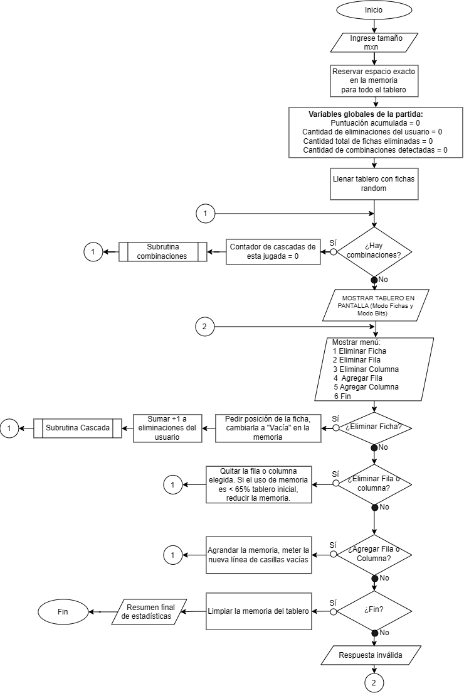
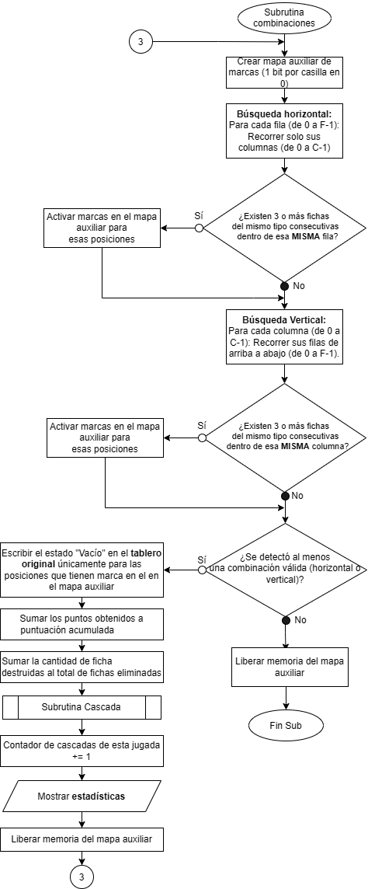
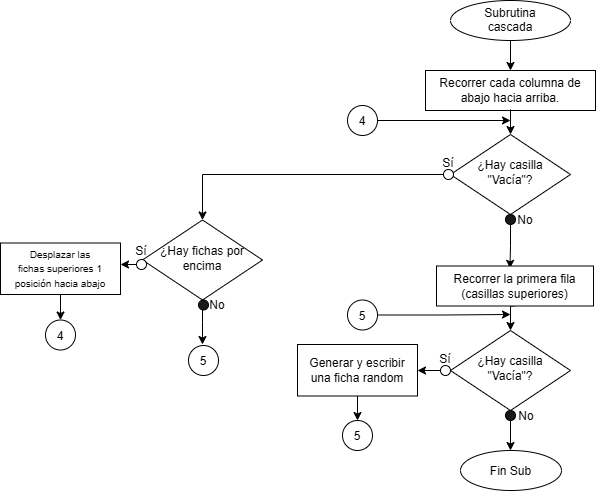

<table>
  <tr>
    <td width="75%" align="center">
      <h2>UNIVERSIDAD DE ANTIOQUIA</h2>
      <h3>Departamento de Ingeniería Electrónica y Telecomunicaciones</h3>
      <h2>INFORMÁTICA II</h2>
      <h3>Desafío No. 1</h3>
    </td>
    <td width="25%" align="center">
      
    </td>
  </tr>
</table>

---

## Integrantes

* **ANDREA JULIETH ARIAS CANTILLO**
* **SANTIAGO GARCIA NARANJO**

---

## 1. CONTEXTUALIZACIÓN

Se plantea hacer un programa jugable llamado **Sweet Crush**, con una dinámica similar pero limitada del famoso juego *Candy Crush*. Se pide utilizar memoria dinámica, uso de punteros y operaciones a nivel de bits para desarrollarlo.

Adicionalmente, se pide representar cada “pieza” o “ficha” del tablero con solamente **3 bits en memoria**, siendo un total de máximo **8 posibles estados**, garantizando que queden organizadas contiguamente en la memoria.

También se pide llevar el conteo de unos parámetros del juego como número de combinaciones realizadas, cascadas, puntuación, etc.

---

## 2. ANÁLISIS Y CONSIDERACIONES

Inicialmente se plantea el uso de un arreglo dinámico para almacenar la representación en memoria de las fichas que se usarán, usando matemáticas para calcular el índice de cada pieza y su relación fila-columna para el tablero final.

Debido a la representación en 3 bits de las piezas, estas podrán estar almacenadas en bytes diferentes, pero esto no debe afectar la funcionalidad ni visualización del tablero.

También se analiza que para el tablero inicial, donde el usuario podrá empezar a jugar, solamente podrán estar vacíos entre **0 y 7 bits a la izquierda del arreglo dinámico**, y que esto está ligado a las dimensiones que el usuario ingrese.

El usuario puede realizar por turno alguna de las siguientes acciones:

* Eliminar ficha.
* Eliminar fila.
* Eliminar columna.
* Agregar fila.
* Agregar columna.
* Terminar juego.

A cada una de las acciones anteriores se le implementará una función.

Para mejorar la experiencia del usuario para escoger la ficha que desee eliminar, se imprimirán en pantalla las coordenadas de **(Fila, Columna)** junto al tablero.

### Funciones propuestas para la solución

#### `crearTablero()`

Reserva el espacio justo en bytes para la correcta representación de todas las fichas que irán en el tablero, teniendo en cuenta las dimensiones que el usuario ingresará.

#### `agregarColumna()` / `agregarFila()`

Amplían la matriz dinámica añadiendo nuevas casillas inicializadas y ajustando los punteros de memoria.

#### `redimenTablero()`

Redimensiona el tablero bajo el criterio de tener menos de un **65 % de utilización** del total de este.

Puede llevarse un contador no visible para el usuario donde se calcule la cantidad de bits desocupados luego de cada jugada del usuario.

#### `reordenarTablero()`

Se encarga de que, luego de una combinación, el tablero quede sin espacios sin ficha asignada, lo que en la mayoría de los casos será la ficha que cae desde “arriba”, visualmente hablando, del espacio vacío (**Imagen 3. Subrutina Cascada**).

#### `eliminarCombin()`

Detecta las combinaciones que tiene el tablero actual y les cambia al estado de ficha especial **“vacío”**, donde luego deberá actuar la función `reordenarTablero()`. (**Imagen 2. Subrutina Combinaciones**).

#### `void printTabFichas()`

Función que muestra en consola el tablero con las fichas. Esta función se ejecutará solamente cuando el tablero a imprimir no tenga combinaciones.

#### `void printTabBits()`

Función que muestra en consola el tablero “real” en relación con la memoria que se ha reservado para el tablero y los bits que se encuentran en cada byte de este.

Es posible que esta representación no tenga las mismas dimensiones que el tablero de fichas.

---

## 3. DISEÑO

Para garantizar el cumplimiento de las restricciones de memoria a bajo nivel y asegurar un flujo de ejecución modular, el diseño del programa se estructuró en un **bucle principal y dos subrutinas independientes**.

A continuación, se presentan los diagramas de flujo.

### 3.1 Flujo Principal del Juego

Representa el ciclo de vida de la partida desde la inicialización de variables globales y reserva de memoria dinámica **(m × n)**, pasando por la evaluación de combinaciones iniciales, hasta el menú interactivo con las opciones de manipulación del tablero (eliminación y adición de filas/columnas, redimensión de memoria al <65 %) y la liberación final de recursos de la memoria.

**Imagen 1. Flujo Principal del Juego**

---

### 3.2 Subrutina de Combinaciones

Describe el proceso de análisis y puntuación. Utiliza un **mapa auxiliar de marcas (1 bit por casilla)** para detectar en simultáneo coincidencias de **3 o más fichas horizontales y verticales**, sin alterar el tablero original durante la inspección.

Posteriormente, transforma los aciertos al estado **“Vacío”**, acumula las estadísticas de la jugada e invoca de forma iterativa a la **Subrutina Cascada**.

**Imagen 2. Subrutina Combinaciones**

---

### 3.3 Subrutina Cascada

Muestra cómo caen las fichas y se llena el tablero.

Primero, recorre las columnas desde abajo hacia arriba para hacer bajar las fichas que quedaron flotando sobre huecos vacíos.

Después, crea fichas aleatorias para ocupar los espacios sueltos que quedan en la

**Imagen 3. Subrutina Cascada**

